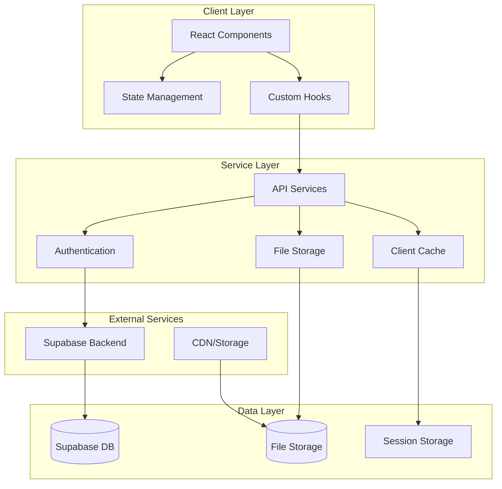

# Design Document

## Overview

This design document outlines the comprehensive transformation of the EPUB Reader application from its current semi-functional state to a production-ready, professional-grade application. The design addresses critical issues in code quality, architecture, performance, user experience, and maintainability while preserving the existing functionality and aesthetic vision.

The current application demonstrates good foundational choices (Next.js 15, Supabase, TypeScript) but suffers from inconsistent patterns, incomplete error handling, performance issues, and technical debt. This design provides a systematic approach to refactoring and enhancing every aspect of the application.

## Architecture

### High-Level Architecture



### Component Architecture

The application will follow a layered component architecture:

1. **Page Components**: Route-level components that orchestrate data fetching and layout
2. **Feature Components**: Complex, stateful components that encapsulate specific functionality
3. **UI Components**: Reusable, presentational components with minimal logic
4. **Layout Components**: Structural components for consistent page layouts

### State Management Strategy

- **Server State**: React Query for API data, caching, and synchronization
- **Client State**: React Context for global UI state (theme, user preferences)
- **Local State**: useState/useReducer for component-specific state
- **Form State**: React Hook Form for complex forms with validation

## Components and Interfaces

### Core Service Interfaces

```typescript
// Core book management service
interface BookService {
  uploadBook(file: File, metadata?: Partial<BookMetadata>): Promise<Book>
  getBooks(filters?: BookFilters): Promise<Book[]>
  getBook(id: string): Promise<Book>
  updateBook(id: string, updates: Partial<Book>): Promise<Book>
  deleteBook(id: string): Promise<void>
}

// Reading progress and annotations
interface ReadingService {
  saveProgress(bookId: string, progress: ReadingProgress): Promise<void>
  getProgress(bookId: string): Promise<ReadingProgress | null>
  createAnnotation(annotation: CreateAnnotationRequest): Promise<Annotation>
  getAnnotations(bookId: string, filters?: AnnotationFilters): Promise<Annotation[]>
  updateAnnotation(id: string, updates: Partial<Annotation>): Promise<Annotation>
  deleteAnnotation(id: string): Promise<void>
}

// EPUB rendering and processing
interface EpubService {
  loadBook(file: File): Promise<EpubBook>
  extractMetadata(file: File): Promise<BookMetadata>
  generateThumbnail(file: File): Promise<Blob>
  validateEpubFile(file: File): Promise<ValidationResult>
}
```

### Component Hierarchy Refactoring

```
src/
├── app/                          # Next.js app router
│   ├── (auth)/                   # Auth route group
│   ├── (dashboard)/              # Main app routes
│   └── api/                      # API routes
├── components/
│   ├── ui/                       # Base UI components
│   │   ├── Button/
│   │   ├── Modal/
│   │   ├── Tooltip/
│   │   └── ...
│   ├── features/                 # Feature-specific components
│   │   ├── BookLibrary/
│   │   ├── EpubReader/
│   │   ├── Annotations/
│   │   └── ...
│   └── layout/                   # Layout components
├── hooks/                        # Custom React hooks
├── services/                     # Business logic services
├── lib/                          # Utilities and configurations
├── types/                        # TypeScript type definitions
└── utils/                        # Pure utility functions
```

### Enhanced Error Handling System

```typescript
// Centralized error handling
class AppError extends Error {
  constructor(
    message: string,
    public code: string,
    public statusCode: number = 500,
    public isOperational: boolean = true
  ) {
    super(message)
    this.name = 'AppError'
  }
}

// Error boundary with recovery options
interface ErrorBoundaryState {
  hasError: boolean
  error: Error | null
  errorInfo: ErrorInfo | null
  retryCount: number
}

// Global error handler
interface ErrorHandler {
  handleError(error: Error, context?: string): void
  reportError(error: Error, metadata?: Record<string, any>): void
  showUserError(message: string, actions?: ErrorAction[]): void
}
```

## Data Models

### Enhanced Type Definitions

```typescript
// Core domain models
interface Book {
  id: string
  userId: string
  title: string
  author: string | null
  description: string | null
  isbn: string | null
  language: string
  publisher: string | null
  publishedDate: Date | null
  pageCount: number | null
  filePath: string
  fileSize: number
  coverPath: string | null
  metadata: BookMetadata
  createdAt: Date
  updatedAt: Date
}

interface BookMetadata {
  format: 'epub'
  version: string
  rights: string | null
  subjects: string[]
  contributors: Contributor[]
  customProperties: Record<string, any>
}

interface ReadingProgress {
  id: string
  userId: string
  bookId: string
  currentLocation: string // CFI or chapter reference
  progressPercentage: number
  readingTimeMinutes: number
  lastReadAt: Date
  sessionData: ReadingSession
}

interface ReadingSession {
  startTime: Date
  endTime?: Date
  pagesRead: number
  wordsRead: number
  averageReadingSpeed: number
}

interface Annotation {
  id: string
  userId: string
  bookId: string
  type: 'highlight' | 'note' | 'bookmark'
  content: string
  note: string | null
  location: string // CFI location
  color: string
  tags: string[]
  isPrivate: boolean
  createdAt: Date
  updatedAt: Date
}
```

### Database Schema Improvements

```sql
-- Enhanced books table with better indexing
CREATE TABLE books (
  id UUID PRIMARY KEY DEFAULT gen_random_uuid(),
  user_id UUID REFERENCES auth.users NOT NULL,
  title TEXT NOT NULL,
  author TEXT,
  description TEXT,
  isbn TEXT,
  language TEXT DEFAULT 'en',
  publisher TEXT,
  published_date DATE,
  page_count INTEGER,
  file_path TEXT NOT NULL,
  file_size BIGINT NOT NULL,
  cover_path TEXT,
  metadata JSONB DEFAULT '{}',
  search_vector tsvector, -- Full-text search
  created_at TIMESTAMPTZ DEFAULT NOW(),
  updated_at TIMESTAMPTZ DEFAULT NOW(),
  
  -- Constraints
  CONSTRAINT valid_file_size CHECK (file_size > 0),
  CONSTRAINT valid_page_count CHECK (page_count IS NULL OR page_count > 0)
);

-- Improved indexes for performance
CREATE INDEX idx_books_user_search ON books USING GIN(user_id, search_vector);
CREATE INDEX idx_books_metadata ON books USING GIN(metadata);
CREATE INDEX idx_books_created_at ON books(user_id, created_at DESC);

-- Enhanced reading progress with session tracking
CREATE TABLE reading_sessions (
  id UUID PRIMARY KEY DEFAULT gen_random_uuid(),
  user_id UUID REFERENCES auth.users NOT NULL,
  book_id UUID REFERENCES books NOT NULL,
  start_time TIMESTAMPTZ DEFAULT NOW(),
  end_time TIMESTAMPTZ,
  pages_read INTEGER DEFAULT 0,
  words_read INTEGER DEFAULT 0,
  created_at TIMESTAMPTZ DEFAULT NOW()
);
```

## Error Handling

### Comprehensive Error Management Strategy

#### 1. Error Classification System

```typescript
enum ErrorType {
  NETWORK = 'NETWORK',
  VALIDATION = 'VALIDATION',
  AUTHENTICATION = 'AUTHENTICATION',
  AUTHORIZATION = 'AUTHORIZATION',
  FILE_PROCESSING = 'FILE_PROCESSING',
  DATABASE = 'DATABASE',
  UNKNOWN = 'UNKNOWN'
}

interface ErrorContext {
  component: string
  action: string
  userId?: string
  bookId?: string
  metadata?: Record<string, any>
}
```

#### 2. Error Boundary Implementation

```typescript
// Global error boundary with recovery strategies
const ErrorBoundary: React.FC<{children: React.ReactNode}> = ({ children }) => {
  return (
    <ErrorBoundaryComponent
      fallback={ErrorFallback}
      onError={(error, errorInfo) => {
        errorHandler.reportError(error, { errorInfo })
      }}
      onReset={() => {
        // Clear error state and retry
        queryClient.invalidateQueries()
      }}
    >
      {children}
    </ErrorBoundaryComponent>
  )
}
```

#### 3. API Error Handling

```typescript
// Centralized API error handling with retry logic
const apiClient = axios.create({
  timeout: 10000,
  retries: 3,
  retryDelay: (retryCount) => Math.pow(2, retryCount) * 1000
})

apiClient.interceptors.response.use(
  (response) => response,
  async (error) => {
    const context = {
      url: error.config?.url,
      method: error.config?.method,
      status: error.response?.status
    }
    
    await errorHandler.handleApiError(error, context)
    return Promise.reject(error)
  }
)
```

#### 4. User-Friendly Error Messages

```typescript
const ERROR_MESSAGES = {
  [ErrorType.NETWORK]: {
    title: 'Connection Problem',
    message: 'Please check your internet connection and try again.',
    actions: ['retry', 'offline-mode']
  },
  [ErrorType.FILE_PROCESSING]: {
    title: 'File Processing Error',
    message: 'This EPUB file appears to be corrupted or unsupported.',
    actions: ['try-different-file', 'contact-support']
  }
  // ... more error types
}
```

## Testing Strategy

### Testing Pyramid Implementation

#### 1. Unit Tests (70% of tests)
- **Components**: Test props, state changes, user interactions
- **Hooks**: Test custom hook logic and side effects
- **Services**: Test business logic and data transformations
- **Utilities**: Test pure functions and edge cases

```typescript
// Example component test
describe('BookCard', () => {
  it('should display book information correctly', () => {
    const book = createMockBook()
    render(<BookCard book={book} />)
    
    expect(screen.getByText(book.title)).toBeInTheDocument()
    expect(screen.getByText(book.author)).toBeInTheDocument()
  })
  
  it('should handle missing cover gracefully', () => {
    const bookWithoutCover = createMockBook({ coverPath: null })
    render(<BookCard book={bookWithoutCover} />)
    
    expect(screen.getByTestId('default-cover')).toBeInTheDocument()
  })
})
```

#### 2. Integration Tests (20% of tests)
- **API Routes**: Test endpoint functionality and error handling
- **Database Operations**: Test CRUD operations and constraints
- **File Processing**: Test EPUB parsing and validation

```typescript
// Example API integration test
describe('/api/books', () => {
  it('should create a new book with valid data', async () => {
    const bookData = createValidBookData()
    const response = await request(app)
      .post('/api/books')
      .send(bookData)
      .expect(201)
    
    expect(response.body).toMatchObject({
      id: expect.any(String),
      title: bookData.title,
      author: bookData.author
    })
  })
})
```

#### 3. End-to-End Tests (10% of tests)
- **Critical User Journeys**: Book upload, reading, annotation creation
- **Cross-browser Compatibility**: Test on major browsers
- **Mobile Responsiveness**: Test touch interactions and layouts

```typescript
// Example E2E test
test('user can upload and read a book', async ({ page }) => {
  await page.goto('/library')
  
  // Upload book
  await page.click('[data-testid="upload-button"]')
  await page.setInputFiles('[data-testid="file-input"]', 'test-book.epub')
  await page.click('[data-testid="upload-confirm"]')
  
  // Verify book appears in library
  await expect(page.locator('[data-testid="book-card"]')).toBeVisible()
  
  // Open book for reading
  await page.click('[data-testid="book-card"]')
  await expect(page.locator('[data-testid="epub-content"]')).toBeVisible()
})
```

### Performance Testing

#### 1. Load Testing
- Test file upload with various EPUB sizes
- Test concurrent user sessions
- Test database query performance under load

#### 2. Performance Monitoring
- Core Web Vitals tracking
- Bundle size monitoring
- Memory leak detection

```typescript
// Performance monitoring setup
const performanceObserver = new PerformanceObserver((list) => {
  for (const entry of list.getEntries()) {
    if (entry.entryType === 'measure') {
      analytics.track('performance_metric', {
        name: entry.name,
        duration: entry.duration,
        startTime: entry.startTime
      })
    }
  }
})

performanceObserver.observe({ entryTypes: ['measure', 'navigation'] })
```

## Security Considerations

### 1. File Upload Security

```typescript
// EPUB file validation
const validateEpubFile = async (file: File): Promise<ValidationResult> => {
  // File size limits
  if (file.size > MAX_FILE_SIZE) {
    throw new AppError('File too large', 'FILE_TOO_LARGE', 413)
  }
  
  // MIME type validation
  if (!ALLOWED_MIME_TYPES.includes(file.type)) {
    throw new AppError('Invalid file type', 'INVALID_FILE_TYPE', 400)
  }
  
  // Content validation
  const buffer = await file.arrayBuffer()
  const isValidEpub = await validateEpubStructure(buffer)
  
  if (!isValidEpub) {
    throw new AppError('Invalid EPUB structure', 'INVALID_EPUB', 400)
  }
  
  return { valid: true }
}
```

### 2. Data Sanitization

```typescript
// Input sanitization for user-generated content
const sanitizeUserInput = (input: string): string => {
  return DOMPurify.sanitize(input, {
    ALLOWED_TAGS: ['b', 'i', 'em', 'strong', 'p', 'br'],
    ALLOWED_ATTR: []
  })
}
```

### 3. Rate Limiting

```typescript
// API rate limiting
const rateLimiter = rateLimit({
  windowMs: 15 * 60 * 1000, // 15 minutes
  max: 100, // Limit each IP to 100 requests per windowMs
  message: 'Too many requests from this IP',
  standardHeaders: true,
  legacyHeaders: false
})
```

## Performance Optimizations

### 1. Code Splitting and Lazy Loading

```typescript
// Route-based code splitting
const LibraryPage = lazy(() => import('./pages/LibraryPage'))
const ReaderPage = lazy(() => import('./pages/ReaderPage'))

// Component-based lazy loading
const AnnotationPanel = lazy(() => import('./components/AnnotationPanel'))
```

### 2. Image Optimization

```typescript
// Optimized image handling for book covers
const optimizeBookCover = async (imageFile: File): Promise<Blob> => {
  const canvas = document.createElement('canvas')
  const ctx = canvas.getContext('2d')
  const img = new Image()
  
  return new Promise((resolve) => {
    img.onload = () => {
      // Resize to standard dimensions
      canvas.width = 300
      canvas.height = 400
      
      ctx?.drawImage(img, 0, 0, 300, 400)
      canvas.toBlob(resolve, 'image/webp', 0.8)
    }
    
    img.src = URL.createObjectURL(imageFile)
  })
}
```

### 3. Caching Strategy

```typescript
// Multi-layer caching approach
const cacheConfig = {
  // Browser cache for static assets
  staticAssets: {
    maxAge: '1y',
    immutable: true
  },
  
  // Service worker cache for offline support
  offlineCache: {
    strategy: 'CacheFirst',
    cacheName: 'epub-reader-offline'
  },
  
  // React Query cache for API data
  queryCache: {
    staleTime: 5 * 60 * 1000, // 5 minutes
    cacheTime: 10 * 60 * 1000 // 10 minutes
  }
}
```

## Deployment and Infrastructure

### 1. CI/CD Pipeline

```yaml
# GitHub Actions workflow
name: Deploy to Production
on:
  push:
    branches: [main]

jobs:
  test:
    runs-on: ubuntu-latest
    steps:
      - uses: actions/checkout@v3
      - name: Setup Node.js
        uses: actions/setup-node@v3
        with:
          node-version: '18'
      - name: Install dependencies
        run: npm ci
      - name: Run tests
        run: npm run test:ci
      - name: Run E2E tests
        run: npm run test:e2e
      
  build:
    needs: test
    runs-on: ubuntu-latest
    steps:
      - name: Build application
        run: npm run build
      - name: Deploy to Vercel
        uses: vercel/action@v1
```

### 2. Monitoring and Observability

```typescript
// Application monitoring setup
const monitoring = {
  // Error tracking
  sentry: {
    dsn: process.env.SENTRY_DSN,
    environment: process.env.NODE_ENV,
    tracesSampleRate: 0.1
  },
  
  // Performance monitoring
  analytics: {
    trackPageViews: true,
    trackUserInteractions: true,
    trackPerformanceMetrics: true
  },
  
  // Health checks
  healthChecks: [
    'database-connection',
    'file-storage-access',
    'external-api-status'
  ]
}
```

### 3. Environment Configuration

```typescript
// Environment-specific configurations
const config = {
  development: {
    database: {
      url: process.env.DATABASE_URL,
      ssl: false
    },
    storage: {
      provider: 'local',
      path: './uploads'
    }
  },
  
  production: {
    database: {
      url: process.env.DATABASE_URL,
      ssl: true,
      poolSize: 20
    },
    storage: {
      provider: 'supabase',
      bucket: 'epub-files'
    }
  }
}
```

This comprehensive design addresses all the requirements while maintaining the existing aesthetic and functionality. The architecture is scalable, maintainable, and follows modern best practices for React/Next.js applications.