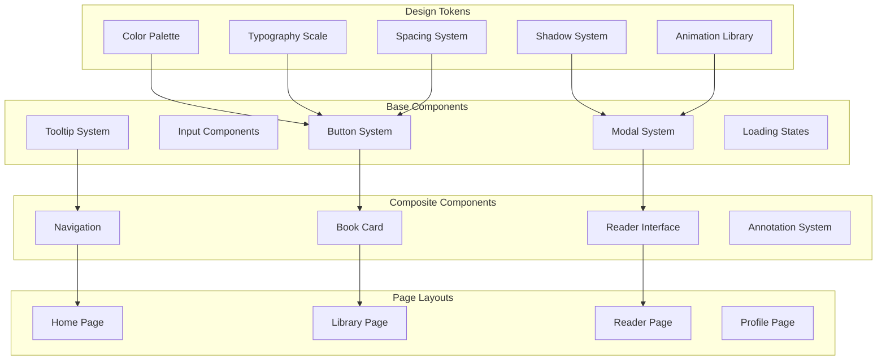

# Design Document

## Overview

This design document outlines a comprehensive UI/UX overhaul for the EPUB Reader application, transforming it from its current functional state into a polished, production-ready experience that rivals the best reading applications. The design emphasizes Apple-inspired aesthetics, exceptional mobile responsiveness, and a cohesive design system that ensures consistency across all touchpoints.

The overhaul will build upon the existing foundation while systematically refining every aspect of the user interface, from micro-interactions to page layouts. The result will be an application that feels premium, accessible, and delightful to use across all devices and contexts.

## Architecture

### Design System Architecture



### Component Hierarchy

The design system follows a hierarchical structure:

1. **Design Tokens**: Foundational values (colors, spacing, typography)
2. **Base Components**: Primitive UI elements (buttons, inputs, modals)
3. **Composite Components**: Feature-specific combinations
4. **Page Layouts**: Complete page implementations
5. **Theme System**: Consistent theming across all levels

### Responsive Design Strategy

The application uses a mobile-first approach with these breakpoints:

- **Mobile**: 320px - 767px (primary focus)
- **Tablet**: 768px - 1023px (adaptive layouts)
- **Desktop**: 1024px+ (enhanced features)

## Components and Interfaces

### Enhanced Design Token System

```typescript
// Comprehensive design tokens
interface DesignTokens {
  colors: {
    // Semantic color system
    primary: ColorScale;
    secondary: ColorScale;
    success: ColorScale;
    warning: ColorScale;
    error: ColorScale;
    
    // Neutral colors
    gray: ColorScale;
    
    // Reading-specific colors
    paper: string;
    ink: string;
    highlight: ColorScale;
  };
  
  typography: {
    // Font families
    sans: string;
    serif: string;
    mono: string;
    
    // Type scale
    sizes: {
      xs: string;
      sm: string;
      base: string;
      lg: string;
      xl: string;
      '2xl': string;
      '3xl': string;
      '4xl': string;
    };
    
    // Line heights
    leading: {
      tight: number;
      normal: number;
      relaxed: number;
    };
    
    // Letter spacing
    tracking: {
      tight: string;
      normal: string;
      wide: string;
    };
  };
  
  spacing: {
    // Consistent spacing scale
    px: string;
    0: string;
    1: string;
    2: string;
    3: string;
    4: string;
    5: string;
    6: string;
    8: string;
    10: string;
    12: string;
    16: string;
    20: string;
    24: string;
    32: string;
    40: string;
    48: string;
    56: string;
    64: string;
  };
  
  shadows: {
    // Layered shadow system
    sm: string;
    base: string;
    md: string;
    lg: string;
    xl: string;
    '2xl': string;
    inner: string;
  };
  
  borderRadius: {
    none: string;
    sm: string;
    base: string;
    md: string;
    lg: string;
    xl: string;
    '2xl': string;
    full: string;
  };
  
  animations: {
    // Consistent timing functions
    easeOut: string;
    easeIn: string;
    easeInOut: string;
    spring: string;
    
    // Duration scale
    fast: string;
    normal: string;
    slow: string;
  };
}
```

### Refined Component System

#### Enhanced Button Component

```typescript
interface ButtonProps {
  variant: 'primary' | 'secondary' | 'ghost' | 'outline' | 'danger';
  size: 'xs' | 'sm' | 'md' | 'lg' | 'xl';
  loading?: boolean;
  disabled?: boolean;
  fullWidth?: boolean;
  leftIcon?: React.ReactNode;
  rightIcon?: React.ReactNode;
  children: React.ReactNode;
  onClick?: () => void;
  // Enhanced accessibility
  ariaLabel?: string;
  ariaDescribedBy?: string;
  // Keyboard shortcuts
  shortcut?: string;
  // Visual enhancements
  pulse?: boolean;
  gradient?: boolean;
}

// Usage examples:
// <Button variant="primary" size="lg" leftIcon={<PlusIcon />}>Add Book</Button>
// <Button variant="ghost" size="sm" shortcut="⌘K">Search</Button>
```

#### Advanced Modal System

```typescript
interface ModalProps {
  isOpen: boolean;
  onClose: () => void;
  size: 'xs' | 'sm' | 'md' | 'lg' | 'xl' | 'full';
  // Enhanced positioning
  position: 'center' | 'top' | 'bottom';
  // Animation variants
  animation: 'fade' | 'slide' | 'scale' | 'drawer';
  // Mobile-specific options
  mobileFullScreen?: boolean;
  // Accessibility enhancements
  title: string;
  description?: string;
  // Advanced features
  persistent?: boolean;
  blurBackground?: boolean;
  children: React.ReactNode;
}
```

#### Sophisticated Tooltip System

```typescript
interface TooltipProps {
  content: React.ReactNode;
  placement: 'top' | 'bottom' | 'left' | 'right' | 'auto';
  // Enhanced positioning
  offset?: number;
  delay?: number;
  // Visual variants
  variant: 'default' | 'info' | 'warning' | 'error';
  // Mobile considerations
  touchable?: boolean;
  // Rich content support
  maxWidth?: number;
  showArrow?: boolean;
  children: React.ReactElement;
}
```

### Page-Specific Design Implementations

#### Home Page Redesign

```typescript
interface HomePageDesign {
  hero: {
    // Refined typography hierarchy
    title: {
      fontSize: 'clamp(48px, 8vw, 96px)';
      fontWeight: 600;
      letterSpacing: '-0.04em';
      lineHeight: 0.95;
    };
    subtitle: {
      fontSize: 'clamp(20px, 4vw, 32px)';
      fontWeight: 500;
      opacity: 0.8;
    };
    description: {
      fontSize: '18px';
      lineHeight: 1.6;
      maxWidth: '600px';
    };
  };
  
  features: {
    layout: 'grid';
    columns: {
      mobile: 1;
      tablet: 2;
      desktop: 3;
    };
    cardDesign: {
      padding: '32px';
      borderRadius: '20px';
      background: 'floating-glass';
      hover: {
        transform: 'translateY(-4px)';
        shadow: 'xl';
      };
    };
  };
  
  navigation: {
    style: 'floating-buttons';
    spacing: '16px';
    buttonSize: 'lg';
  };
}
```

#### Library Page Enhancement

```typescript
interface LibraryPageDesign {
  header: {
    layout: 'flex-between';
    title: {
      fontSize: '32px';
      fontWeight: 600;
      tracking: 'tight';
    };
    actions: {
      layout: 'horizontal';
      spacing: '12px';
      buttonSize: 'md';
    };
  };
  
  bookGrid: {
    // Responsive grid system
    columns: {
      mobile: 3;
      tablet: 4;
      desktop: 6;
      xl: 8;
    };
    gap: '24px';
    aspectRatio: '3/4';
    
    // Enhanced book cards
    card: {
      borderRadius: '12px';
      shadow: 'sm';
      hover: {
        shadow: 'lg';
        transform: 'scale(1.02)';
      };
      
      // Overlay controls
      overlay: {
        opacity: 0;
        background: 'rgba(0,0,0,0.6)';
        backdropFilter: 'blur(8px)';
        transition: 'all 0.2s ease';
      };
    };
  };
  
  // Advanced search and filtering
  searchBar: {
    position: 'sticky';
    background: 'floating-glass';
    borderRadius: '16px';
    padding: '12px 20px';
    fontSize: '16px';
  };
  
  // Empty state design
  emptyState: {
    illustration: 'custom-svg';
    title: 'elegant-typography';
    action: 'primary-button';
  };
}
```

#### Reader Page Transformation

```typescript
interface ReaderPageDesign {
  // Contextual UI system
  contextualControls: {
    // Desktop floating toolbar
    desktop: {
      position: 'fixed-top-center';
      background: 'floating-glass-strong';
      borderRadius: '20px';
      padding: '16px 24px';
      shadow: '2xl';
      
      // Auto-hide behavior
      autoHide: {
        delay: 3000;
        trigger: 'mouse-idle';
        animation: 'fade-slide';
      };
    };
    
    // Mobile bottom sheet
    mobile: {
      position: 'bottom-sheet';
      height: 'auto';
      background: 'surface';
      borderRadius: '20px 20px 0 0';
      
      // Gesture controls
      gestures: {
        swipeUp: 'expand';
        swipeDown: 'collapse';
        tap: 'toggle';
      };
    };
  };
  
  // Reading area optimization
  readingArea: {
    // Typography perfection
    typography: {
      fontFamily: 'system-serif';
      fontSize: 'clamp(16px, 4vw, 20px)';
      lineHeight: 1.7;
      letterSpacing: '-0.003em';
      maxWidth: '65ch';
      margin: '0 auto';
    };
    
    // Distraction-free design
    padding: {
      mobile: '24px 20px';
      tablet: '40px 32px';
      desktop: '48px 40px';
    };
    
    // Theme-aware backgrounds
    background: {
      light: '#fefefe';
      dark: '#1a1a1a';
      sepia: '#f4f1ea';
    };
  };
  
  // Enhanced annotation system
  annotations: {
    // Selection toolbar
    selectionToolbar: {
      position: 'floating-above-selection';
      background: 'dark-glass';
      borderRadius: '12px';
      padding: '8px';
      
      // Color palette
      colors: [
        '#fbbf24', // Yellow
        '#34d399', // Green
        '#60a5fa', // Blue
        '#f87171', // Red
        '#a78bfa', // Purple
      ];
    };
    
    // Annotation panel
    panel: {
      width: '320px';
      position: 'slide-from-right';
      background: 'surface';
      shadow: '2xl';
      
      // Annotation cards
      card: {
        padding: '16px';
        borderRadius: '12px';
        border: '1px solid border-color';
        margin: '8px 0';
      };
    };
  };
  
  // Navigation enhancements
  navigation: {
    // Page turning
    gestures: {
      swipe: 'horizontal-page-turn';
      tap: 'edge-navigation';
      keyboard: 'arrow-keys';
    };
    
    // Progress indication
    progress: {
      position: 'bottom-fixed';
      height: '4px';
      background: 'accent-color';
      animation: 'smooth-fill';
    };
    
    // Chapter navigation
    tableOfContents: {
      position: 'slide-from-left';
      width: '300px';
      background: 'floating-glass';
      borderRadius: '20px';
      
      // Nested structure
      nesting: {
        indentation: '16px';
        fontSize: 'scale-down';
        opacity: 'reduce';
      };
    };
  };
}
```

## Data Models

### Enhanced Theme System

```typescript
interface ThemeConfiguration {
  // Base theme properties
  id: string;
  name: string;
  type: 'light' | 'dark' | 'auto';
  
  // Color definitions
  colors: {
    // Background layers
    background: {
      primary: string;
      secondary: string;
      tertiary: string;
    };
    
    // Text colors
    text: {
      primary: string;
      secondary: string;
      tertiary: string;
      inverse: string;
    };
    
    // Interactive elements
    interactive: {
      primary: string;
      secondary: string;
      hover: string;
      active: string;
      disabled: string;
    };
    
    // Semantic colors
    semantic: {
      success: string;
      warning: string;
      error: string;
      info: string;
    };
    
    // Reading-specific
    reading: {
      background: string;
      text: string;
      highlight: string[];
      selection: string;
    };
  };
  
  // Typography settings
  typography: {
    fontFamily: {
      sans: string;
      serif: string;
      mono: string;
    };
    
    // Reading preferences
    reading: {
      fontSize: number;
      lineHeight: number;
      letterSpacing: number;
      fontFamily: string;
    };
  };
  
  // Visual effects
  effects: {
    blur: {
      light: string;
      medium: string;
      heavy: string;
    };
    
    shadows: {
      sm: string;
      md: string;
      lg: string;
      xl: string;
    };
    
    borders: {
      width: string;
      color: string;
      radius: {
        sm: string;
        md: string;
        lg: string;
        xl: string;
      };
    };
  };
}
```

### User Preference System

```typescript
interface UserPreferences {
  // Theme preferences
  theme: {
    mode: 'light' | 'dark' | 'auto';
    customThemes: ThemeConfiguration[];
    activeTheme: string;
  };
  
  // Reading preferences
  reading: {
    fontSize: number; // 14-24px
    lineHeight: number; // 1.4-2.0
    fontFamily: 'serif' | 'sans' | 'mono';
    textAlign: 'left' | 'justify';
    columnWidth: number; // 45-75ch
    
    // Page layout
    margins: {
      top: number;
      bottom: number;
      left: number;
      right: number;
    };
    
    // Interaction preferences
    pageTransition: 'slide' | 'fade' | 'none';
    autoHideControls: boolean;
    autoHideDelay: number; // milliseconds
  };
  
  // Accessibility preferences
  accessibility: {
    reduceMotion: boolean;
    highContrast: boolean;
    focusVisible: boolean;
    screenReaderOptimized: boolean;
  };
  
  // Library preferences
  library: {
    viewMode: 'grid' | 'list';
    sortBy: 'title' | 'author' | 'dateAdded' | 'lastRead';
    sortOrder: 'asc' | 'desc';
    gridSize: 'compact' | 'comfortable' | 'spacious';
  };
  
  // Annotation preferences
  annotations: {
    defaultColor: string;
    showInMargins: boolean;
    exportFormat: 'markdown' | 'json' | 'csv';
  };
}
```

## Error Handling

### Enhanced Error UI System

```typescript
interface ErrorHandlingDesign {
  // Error boundary components
  errorBoundary: {
    // Graceful error pages
    fullPage: {
      illustration: 'custom-svg';
      title: 'Something went wrong';
      description: 'detailed-but-friendly';
      actions: ['retry', 'report', 'home'];
    };
    
    // Component-level errors
    component: {
      fallback: 'skeleton-with-error-icon';
      retry: 'inline-button';
      dismiss: 'close-button';
    };
  };
  
  // Toast notification system
  notifications: {
    position: 'top-right';
    maxVisible: 3;
    autoHide: true;
    duration: 5000;
    
    variants: {
      success: {
        icon: 'check-circle';
        color: 'green';
        background: 'success-light';
      };
      error: {
        icon: 'exclamation-triangle';
        color: 'red';
        background: 'error-light';
      };
      warning: {
        icon: 'exclamation-circle';
        color: 'yellow';
        background: 'warning-light';
      };
      info: {
        icon: 'information-circle';
        color: 'blue';
        background: 'info-light';
      };
    };
  };
  
  // Loading states
  loadingStates: {
    // Skeleton screens
    skeleton: {
      animation: 'pulse';
      borderRadius: 'match-content';
      background: 'shimmer-gradient';
    };
    
    // Spinner variants
    spinners: {
      button: 'inline-spinner';
      page: 'centered-spinner';
      overlay: 'backdrop-spinner';
    };
    
    // Progress indicators
    progress: {
      linear: 'animated-bar';
      circular: 'spinning-circle';
      stepped: 'progress-steps';
    };
  };
  
  // Form validation
  validation: {
    // Inline validation
    inline: {
      position: 'below-field';
      color: 'error-color';
      fontSize: 'sm';
      animation: 'slide-down';
    };
    
    // Field states
    fieldStates: {
      error: {
        border: 'error-color';
        background: 'error-light';
        icon: 'exclamation-circle';
      };
      success: {
        border: 'success-color';
        icon: 'check-circle';
      };
    };
  };
}
```

## Testing Strategy

### Visual Testing Framework

```typescript
interface VisualTestingStrategy {
  // Component testing
  components: {
    // Storybook integration
    storybook: {
      stories: 'all-component-variants';
      controls: 'interactive-props';
      docs: 'auto-generated';
    };
    
    // Visual regression testing
    chromatic: {
      snapshots: 'all-stories';
      browsers: ['chrome', 'firefox', 'safari'];
      viewports: ['mobile', 'tablet', 'desktop'];
    };
  };
  
  // Accessibility testing
  accessibility: {
    // Automated testing
    axe: {
      rules: 'wcag-2.1-aa';
      integration: 'jest-axe';
    };
    
    // Manual testing checklist
    manual: {
      keyboard: 'tab-navigation';
      screenReader: 'voiceover-nvda';
      colorContrast: 'manual-verification';
    };
  };
  
  // Performance testing
  performance: {
    // Core Web Vitals
    vitals: {
      lcp: '<2.5s';
      fid: '<100ms';
      cls: '<0.1';
    };
    
    // Bundle analysis
    bundle: {
      size: 'track-changes';
      treeshaking: 'verify-unused';
    };
  };
  
  // Cross-browser testing
  crossBrowser: {
    browsers: [
      'Chrome (latest)',
      'Firefox (latest)',
      'Safari (latest)',
      'Edge (latest)',
    ];
    
    devices: [
      'iPhone 12/13/14',
      'iPad',
      'Android phones',
      'Desktop screens',
    ];
  };
}
```

## Performance Optimizations

### Advanced Performance Strategy

```typescript
interface PerformanceOptimizations {
  // Code splitting
  codeSplitting: {
    // Route-based splitting
    routes: {
      home: 'lazy-loaded';
      library: 'lazy-loaded';
      reader: 'lazy-loaded';
      profile: 'lazy-loaded';
    };
    
    // Component-based splitting
    components: {
      modal: 'dynamic-import';
      tooltip: 'dynamic-import';
      annotations: 'dynamic-import';
    };
  };
  
  // Image optimization
  images: {
    // Book covers
    covers: {
      formats: ['webp', 'avif', 'jpg'];
      sizes: ['150w', '300w', '600w'];
      loading: 'lazy';
      placeholder: 'blur-data-url';
    };
    
    // Progressive loading
    progressive: {
      lowQuality: 'immediate';
      highQuality: 'intersection-observer';
    };
  };
  
  // Caching strategy
  caching: {
    // Service worker
    serviceWorker: {
      strategy: 'cache-first';
      assets: ['fonts', 'icons', 'css'];
      api: 'network-first';
    };
    
    // Browser caching
    browser: {
      static: '1-year';
      dynamic: '5-minutes';
      api: 'no-cache';
    };
  };
  
  // Virtual scrolling
  virtualScrolling: {
    // Large book libraries
    library: {
      itemHeight: 'variable';
      overscan: 5;
      threshold: 100;
    };
    
    // Long documents
    reader: {
      chunkSize: '10-pages';
      preload: 'next-chunk';
    };
  };
  
  // Animation performance
  animations: {
    // GPU acceleration
    gpu: {
      properties: ['transform', 'opacity'];
      willChange: 'auto';
    };
    
    // Reduced motion
    reducedMotion: {
      respect: 'prefers-reduced-motion';
      fallback: 'instant-transitions';
    };
  };
}
```

## Mobile-Specific Enhancements

### Advanced Mobile Design

```typescript
interface MobileEnhancements {
  // Touch interactions
  touch: {
    // Gesture system
    gestures: {
      swipe: {
        sensitivity: 'configurable';
        directions: ['left', 'right', 'up', 'down'];
        feedback: 'haptic';
      };
      
      pinch: {
        zoom: 'text-scaling';
        threshold: 'comfortable';
      };
      
      longPress: {
        duration: '500ms';
        feedback: 'haptic';
        action: 'context-menu';
      };
    };
    
    // Target sizes
    targets: {
      minimum: '44px';
      comfortable: '48px';
      spacing: '8px';
    };
  };
  
  // Mobile navigation
  navigation: {
    // Bottom navigation
    bottomNav: {
      height: '60px';
      background: 'floating-glass';
      borderRadius: '20px 20px 0 0';
      items: ['library', 'reader', 'profile'];
    };
    
    // Drawer navigation
    drawer: {
      width: '280px';
      overlay: 'backdrop-blur';
      animation: 'slide-from-left';
    };
  };
  
  // Mobile-specific components
  components: {
    // Bottom sheets
    bottomSheet: {
      heights: ['peek', 'half', 'full'];
      gestures: ['drag', 'swipe'];
      backdrop: 'dismissible';
    };
    
    // Action sheets
    actionSheet: {
      position: 'bottom';
      animation: 'slide-up';
      items: 'large-touch-targets';
    };
    
    // Mobile modals
    modals: {
      fullScreen: 'small-screens';
      animation: 'slide-up';
      closeButton: 'top-right';
    };
  };
  
  // Responsive typography
  typography: {
    // Fluid scaling
    scaling: {
      base: 'clamp(14px, 4vw, 16px)';
      headings: 'clamp(20px, 6vw, 32px)';
      reading: 'user-configurable';
    };
    
    // Touch-friendly line heights
    lineHeight: {
      minimum: 1.5;
      comfortable: 1.6;
      spacious: 1.8;
    };
  };
  
  // Mobile performance
  performance: {
    // Touch responsiveness
    touch: {
      delay: '<16ms';
      feedback: 'immediate';
    };
    
    // Scroll performance
    scroll: {
      momentum: 'native';
      fps: '60fps';
      smoothness: 'optimized';
    };
    
    // Battery optimization
    battery: {
      animations: 'efficient';
      background: 'minimal';
      polling: 'reduced';
    };
  };
}
```

This comprehensive design document provides the foundation for transforming the EPUB Reader into a truly exceptional, production-ready application. The design emphasizes consistency, accessibility, performance, and user delight across all touchpoints and devices.