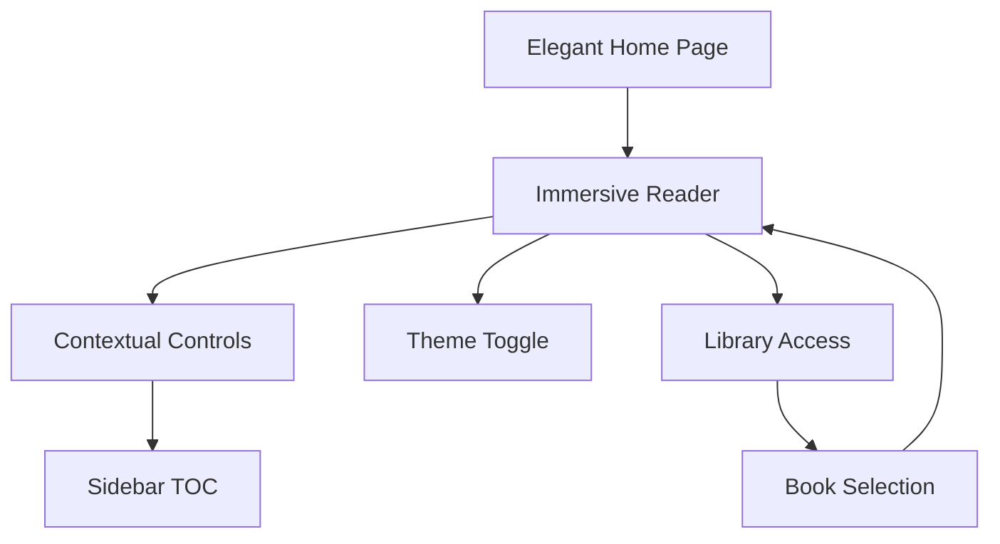

# EPUB Reader UI/UX Improvement Plan

## 1. Product Overview

Transform the current utilitarian EPUB reader into an elegant, premium reading experience with sophisticated visual design and refined interactions. The goal is to achieve "faux-minimalism" - thoughtful, elegant modern minimalism that feels premium and sophisticated rather than stark or bare.

* Replace the current ugly gray glass bars with seamless, contextual UI elements that enhance rather than distract from the reading experience

* Create a cohesive visual hierarchy with improved typography, spacing, and interactive elements that feel premium and modern

## 2. Core Features

### 2.1 Feature Module

Our improved EPUB reader consists of the following refined pages:

1. **Home page**: elegant hero section with premium branding, sophisticated navigation buttons
2. **Reader page**: immersive reading interface with contextual controls, floating navigation, premium typography
3. **Library page**: refined book grid with elegant cards and smooth interactions

### 2.2 Page Details

| Page Name    | Module Name            | Feature description                                                                                 |
| ------------ | ---------------------- | --------------------------------------------------------------------------------------------------- |
| Home page    | Hero section           | Clean typography with refined spacing, premium button styling with subtle shadows and hover effects |
| Home page    | Navigation             | Sophisticated rounded buttons with elegant hover states and smooth transitions                      |
| Reader page  | Floating header        | Contextual header that appears on hover/interaction, seamlessly integrated without harsh borders    |
| Reader page  | Immersive reading area | Clean, distraction-free reading zone with optimal typography and spacing                            |
| Reader page  | Contextual sidebar     | Elegant table of contents with smooth slide-in animation and refined typography                     |
| Reader page  | Floating controls      | Subtle navigation controls that appear contextually, positioned elegantly without disrupting flow   |
| Reader page  | Theme system           | Sophisticated light/dark themes with smooth transitions and premium color palettes                  |
| Reader page  | Progress indicators    | Elegant chapter titles and reading progress with subtle animations                                  |
| Library page | Book grid              | Refined book cards with subtle shadows, smooth hover effects, and elegant typography                |
| Library page | Import interface       | Premium file upload experience with drag-and-drop and elegant feedback                              |

## 3. Core Process

**User Reading Journey:**

1. User lands on elegant home page with clear, premium branding
2. User clicks "Try Reader" to enter immersive reading experience
3. Reader opens with contextual file picker (no harsh UI interruption)
4. Once book loads, user enters distraction-free reading mode
5. UI controls appear contextually on hover/interaction
6. Sidebar TOC slides in smoothly when needed
7. Theme toggle provides seamless light/dark transitions
8. Navigation feels fluid with keyboard, click, and gesture support

## 4. User Interface Design

### 4.1 Design Style

**Color Palette:**

* Primary: Sophisticated neutral grays (#f8f9fa, #e9ecef, #6c757d)

* Dark mode: Rich blacks and warm grays (#0d1117, #161b22, #21262d)

* Accent: Refined blue (#0066cc) with subtle variations

* Text: High contrast with perfect readability (#212529, #f8f9fa)

**Typography:**

* Primary font: Geist Sans (already implemented) with refined sizing

* Reading font: Optimized serif for long-form reading

* Font sizes: Carefully scaled hierarchy (12px, 14px, 16px, 20px, 24px, 32px)

* Line height: Generous 1.6-1.8 for optimal readability

**Interactive Elements:**

* Buttons: Subtle rounded corners (8px), soft shadows, smooth hover transitions

* Cards: Elegant elevation with 2-4px shadows, rounded corners (12px)

* Animations: Smooth 200-300ms transitions with easing curves

* Hover states: Subtle scale (1.02x) and shadow increases

**Layout Philosophy:**

* Generous whitespace and breathing room

* Contextual UI that appears when needed

* Seamless transitions between states

* No harsh borders or dividers

* Floating elements with subtle shadows

### 4.2 Page Design Overview

| Page Name    | Module Name         | UI Elements                                                                                                 |
| ------------ | ------------------- | ----------------------------------------------------------------------------------------------------------- |
| Home page    | Hero section        | Large, elegant typography (32px), generous spacing (80px vertical), subtle background gradient              |
| Home page    | Navigation buttons  | Rounded-full buttons with 16px padding, subtle shadows (0 2px 8px rgba(0,0,0,0.1)), smooth hover animations |
| Reader page  | Floating header     | Appears on hover with smooth fade-in, backdrop blur effect, no harsh borders, elegant typography            |
| Reader page  | Reading container   | Maximum width 800px, centered, optimal line length, generous margins (40px)                                 |
| Reader page  | Contextual sidebar  | Slides in from left with smooth animation, elegant typography, subtle background                            |
| Reader page  | Navigation controls | Floating circular buttons with subtle shadows, appear on hover, smooth transitions                          |
| Reader page  | Chapter overlay     | Subtle rounded background (rgba(0,0,0,0.05)), elegant positioning, fade animations                          |
| Reader page  | Theme toggle        | Smooth icon transitions, elegant positioning in floating header                                             |
| Library page | Book cards          | Elegant shadows (0 4px 12px rgba(0,0,0,0.1)), rounded corners (12px), smooth hover scale                    |
| Library page | Import area         | Drag-and-drop zone with elegant dashed borders, smooth feedback animations                                  |

### 4.3 Responsiveness

Desktop-first design with mobile-adaptive layouts. Touch interactions optimized for mobile with larger touch targets (44px minimum) and gesture-friendly navigation. Sidebar collapses to overlay on mobile with smooth slide animations.

### 4.4 Key Improvements

**Eliminate Gray Bars:**

* Remove glass header/footer with harsh borders

* Replace with contextual floating elements

* Use subtle shadows and backdrop blur for depth

* Implement smooth show/hide animations

**Enhanced Visual Hierarchy:**

* Refined typography scale with proper contrast

* Generous whitespace and breathing room

* Subtle color variations for different UI states

* Elegant hover and focus states

**Premium Interactions:**

* Smooth transitions for all state changes

* Contextual UI that appears when needed

* Gesture-friendly navigation

* Sophisticated loading and feedback animations

**Reading Experience:**

* Optimal line length and spacing for readability

* Distraction-free immersive mode

* Smooth page transitions

* Elegant progress indicators

